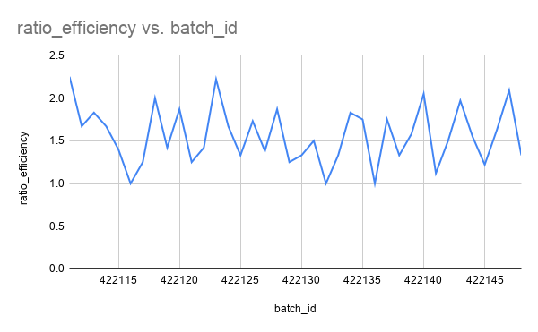

# Introduction

This project analyzes manufacturing production and downtime data to understand how efficiently production is running and where operational problems may be occurring.

The analysis focuses on **production efficiency, operator performance, downtime patterns, and operator-related errors.** The goal is to use SQL to answer key business questions such as:

* **Batch Efficiency:** How efficiently are batches being produced compared with their minimum expected production time?

* **Operator Benchmarks:** Are some operators performing below the production benchmark?

* **Downtime Root Causes:** Which downtime factors occur most frequently and contribute the most downtime?

* **Error Patterns:** Are there particular types of operator errors associated with specific operators?

By breaking the data down across batches, operators, and downtime factors, this project aims to turn raw manufacturing data into actionable findings that help identify areas for operational improvement.

# Background


The dataset represents manufacturing production and downtime activity across a production line. It contains information about the products being produced, production batches, operators, production duration, downtime events, and the factors associated with those downtime events.

The **`line_productivity`** table provides information about production batches, including the operator responsible, the product being produced, and the time taken to complete each batch. The **`products`** table contains the minimum expected production time for each product, which provides a benchmark for evaluating production efficiency.

The **`line_downtime`** table records downtime events and the amount of production time lost, while the **`downtime_factors`** table provides descriptions of the factors associated with those events and identifies factors classified as operator errors.

Using these tables together makes it possible to examine production efficiency, compare operator performance against the production benchmark, identify the most frequent and time-consuming downtime factors, and explore operator-specific error patterns.

The analysis was conducted using SQL in **Google BigQuery**, with the focus on transforming the raw manufacturing data into clear metrics and business insights.

# Tools I Used

* **Google Sheets:** Used for initial data inspection, cleaning, and organizing the dataset before analysis.

* **Google BigQuery:** Used to query, transform, join, and analyze the manufacturing dataset using SQL.

* **SQL:** Used to calculate production efficiency ratios, compare operator performance, identify downtime patterns, and analyze operator-related errors.

* **GitHub:** Used to organize the project, store the SQL queries, and document the analysis and findings in the README.

# The Analysis

The analysis was built around five key business questions. SQL was used to connect the relevant tables, calculate performance metrics, and identify patterns in production efficiency and downtime.

## 1. How efficient is each production batch?

To measure batch efficiency, I joined the `line_productivity` table with the `products` table using `product_id` to bring in the `min_batch_time` for each product.

I then calculated a **ratio efficiency** for each batch:

`duration_in_minutes / min_batch_time`

```sql
WITH production_table AS (
  SELECT
    production.*,
    product.min_batch_time
  FROM manufacturing_downtime.line_productivity AS production
  INNER JOIN manufacturing_downtime.products AS product
    ON production.product_id = product.product_id
)

SELECT
  production_table.batch_id,
  ROUND(SAFE_DIVIDE(production_table.duration_in_minutes, production_table.min_batch_time), 2) AS ratio_efficiency
FROM production_table
 ```

A ratio of **1.00** means the batch took exactly the minimum expected production time, while a ratio above 1.00 indicates that the batch took longer than the minimum benchmark.



## 2. Are any operators underperforming?

To compare operators, I used a **time-weighted efficiency ratio** by dividing each operator's total production time by their total minimum expected production time.

```sql
WITH production_table AS (
  SELECT
    production.batch_id AS batch_id,
    production.operator_name AS operator_name,
    production.duration_in_minutes AS duration,
    product.min_batch_time AS min_time
  FROM manufacturing_downtime.line_productivity AS production
  INNER JOIN manufacturing_downtime.products AS product
    ON production.product_id = product.product_id
)

SELECT
  production_table.operator_name AS operator_name,
  ROUND(SAFE_DIVIDE(SUM(production_table.duration), SUM(production_table.min_time)), 2) AS general_ratio_efficiency
FROM production_table
GROUP BY
  production_table.operator_name
ORDER BY
  general_ratio_efficiency DESC
```

| Operator | General Ratio Efficiency |
| -------- | -----------------------: |
| Mac      |                     1.64 |
| Dennis   |                     1.58 |
| Dee      |                     1.56 |
| Charlie  |                     1.50 |

Mac had the highest ratio at **1.64**, meaning Mac's total production time was 64% above the total minimum expected production time. Dennis, Dee, and Charlie were 58%, 56%, and 50% above their respective benchmarks.

This metric shows the relative gap from the minimum production benchmark and should not be interpreted as a measure of operator quality on its own, since factors such as product mix and downtime may also affect production time.

## 3. What are the leading downtime factors by frequency?

A 1/0 flag was created to identify downtime records, and the flags were then aggregated by `factor_id`.

```sql
 WITH leading_factors AS (
  SELECT *,
    CASE
      WHEN downtime.downtime_in_minutes IS NULL THEN 0
      ELSE 1
    END AS factor_flag
 FROM manufacturing_downtime.line_downtime AS downtime
),
factor_count AS (
SELECT
  leading_factors.factor_id AS factor_id,
  SUM(leading_factors.factor_flag) AS flag_count
FROM leading_factors
GROUP BY
  leading_factors.factor_id  
)

SELECT
  factor_count.factor_id,
  factors.description,
  factor_count.flag_count
FROM factor_count
INNER JOIN manufacturing_downtime.downtime_factors AS factors
  ON factor_count.factor_id = factors.factor_id
ORDER BY
  factor_count.flag_count DESC
```

| Factor             | Downtime Occurrences |
| ------------------ | -------------------: |
| Machine adjustment |                   12 |
| Machine failure    |                   11 |
| Inventory shortage |                    9 |
| Batch coding error |                    6 |
| Batch change       |                    5 |
| Other              |                    5 |
| Product spill      |                    3 |
| Calibration error  |                    3 |
| Label switch       |                    3 |
| Labeling error     |                    2 |
| Conveyor belt jam  |                    1 |
| Emergency stop     |                    0 |

**Machine adjustment** was the most frequently recorded downtime factor, followed by **machine failure** and **inventory shortage**.

## 4. Which downtime factors contribute the most downtime minutes?

To measure the impact of each downtime factor, I summed the recorded `downtime_in_minutes` for each `factor_id`.

```sql
WITH downtime_account AS(
  SELECT
    downtime.factor_id AS factor_id,
    SUM(COALESCE(downtime.downtime_in_minutes, 0)) AS downtime_contribution
  FROM manufacturing_downtime.line_downtime AS downtime
  GROUP BY
    downtime.factor_id
)

SELECT
  downtime_account.factor_id,
  factors.description,
  downtime_account.downtime_contribution
FROM downtime_account
INNER JOIN manufacturing_downtime.downtime_factors AS factors
  ON downtime_account.factor_id = factors.factor_id
ORDER BY
  downtime_account.downtime_contribution DESC
```

| Factor             | Downtime Contribution (Minutes) |
| ------------------ | ------------------------------: |
| Machine adjustment |                             332 |
| Machine failure    |                             254 |
| Inventory shortage |                             225 |
| Batch change       |                             160 |
| Batch coding error |                             145 |
| Other              |                              67 |
| Product spill      |                              57 |
| Calibration error  |                              49 |
| Labeling error     |                              42 |
| Label switch       |                              33 |
| Conveyor belt jam  |                              17 |
| Emergency stop     |                               0 |

The analysis recorded **1,381 total downtime minutes**. The three largest contributors — **machine adjustment, machine failure, and inventory shortage** — accounted for **811 minutes**, or approximately **58.7%** of total recorded downtime.

The frequency and downtime-contribution analyses also showed that how often a factor occurs does not always match how much time it consumes. For example, **batch change** occurred 5 times but accounted for 160 minutes, while **batch coding error** occurred 6 times and accounted for 145 minutes.

## 5. Do any operators struggle with particular types of operator error?

To investigate operator-related errors, I connected downtime records to operators through `batch_id` and filtered the downtime factors classified as `operator_error = TRUE`.

```sql
WITH downtime1 AS (
SELECT *,
  CASE
    WHEN downtime.downtime_in_minutes is NULL THEN 0
    ELSE 1
  END AS flag_count
FROM manufacturing_downtime.line_downtime AS downtime
),
downtime2 AS (
  SELECT
    downtime1.batch_id AS batch_id,
    production.operator_name as operator_name,
    downtime1.factor_id AS factor_id,
    downtime1.flag_count AS flag_count
  FROM downtime1
  INNER JOIN manufacturing_downtime.line_productivity AS production
    ON downtime1.batch_id = production.batch_id
),
analysis1 AS (
  SELECT
    downtime2.operator_name AS operator_name,
    downtime2.factor_id AS factor_id,
    SUM(downtime2.flag_count) AS flag_count
  FROM downtime2
  GROUP BY
    downtime2.operator_name,
    downtime2.factor_id
),
analysis2 AS (
  SELECT
    analysis1.operator_name AS operator_name,
    analysis1.factor_id AS factor_id,
    analysis1.flag_count AS flag_count,
    factors.description AS description,
    factors.operator_error AS operator_error
  FROM analysis1
  INNER JOIN manufacturing_downtime.downtime_factors AS factors
    ON analysis1.factor_id = factors.factor_id
)

SELECT *
FROM analysis2
WHERE
  analysis2.flag_count > 0 AND
  analysis2.operator_error is TRUE
```

| Operator | Operator Error Factor | Occurrences |
| -------- | --------------------- | ----------: |
| Mac      | Batch change          |           3 |
| Mac      | Batch coding error    |           3 |
| Mac      | Machine adjustment    |           1 |
| Charlie  | Machine adjustment    |           4 |
| Charlie  | Batch change          |           1 |
| Charlie  | Product spill         |           1 |
| Charlie  | Batch coding error    |           1 |
| Charlie  | Calibration error     |           1 |
| Charlie  | Label switch          |           1 |
| Dee      | Machine adjustment    |           3 |
| Dee      | Calibration error     |           2 |
| Dee      | Label switch          |           2 |
| Dee      | Batch change          |           1 |
| Dee      | Product spill         |           1 |
| Dee      | Batch coding error    |           1 |
| Dennis   | Machine adjustment    |           4 |
| Dennis   | Product spill         |           1 |
| Dennis   | Batch coding error    |           1 |

**Machine adjustment** was the most frequently recorded operator-error factor for Charlie, Dee, and Dennis. Mac showed a different pattern, with **Batch change** and **Batch coding error** appearing most frequently.

These are frequency-based observations and do not by themselves establish that one operator struggles more than another, since the number of batches handled by each operator is not accounted for in these raw counts.

# Conclusion

## Insights

The analysis showed that production batches generally took longer than their minimum expected production times, with operator-level ratios ranging from **1.50 to 1.64**. Mac had the highest overall ratio at **1.64**, followed by Dennis at **1.58**, Dee at **1.56**, and Charlie at **1.50**.

Downtime analysis showed that **Machine adjustment, Machine failure, and Inventory shortage** were the three most frequently recorded downtime factors and also the largest contributors to downtime minutes. Together, they accounted for **811 of the 1,381 recorded downtime minutes (58.7%)**.

The analysis also revealed that downtime frequency does not always correspond to total downtime impact. For example, **Batch change** was recorded 5 times but contributed **160 minutes** of downtime, while **Batch coding error** occurred 6 times and contributed **145 minutes**.

For operator-related errors, **Machine adjustment** appeared most frequently for Charlie, Dee, and Dennis, while Mac's most frequent operator-error factors were **Batch change** and **Batch coding error**. These findings highlight patterns that could be investigated further, rather than being treated as definitive measures of operator performance.

## Remarks

This project gave me practical experience using SQL to connect multiple tables, create calculated metrics, aggregate data, and turn raw manufacturing records into business insights.

It was fun.

